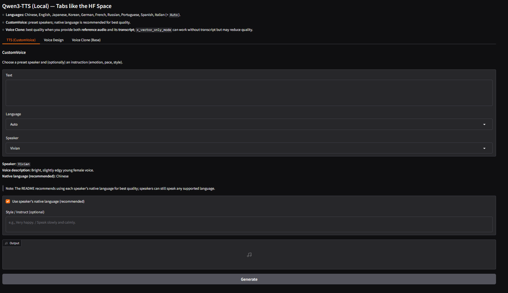

# Why
Saw the qwen3-tts demo and thought, this must work on my truenas scale server as an custom yaml container. Here you go. 

# Versions
## Truenas Scale
I am at 25.04 Fangtooth

## GPU
3090 RTX

# What is working and what does not
## working
Base qwen3-tts is working. 3 Tabs, like the demo.

## not working

# How
## without flash-attn
Just built a custom app with those yaml instruction and put the app.py into the main directory so the yaml can load it

## wtih flash-attn
Flash-attn with container from https://hub.docker.com/r/javirub/flashattention-pytorch

javirub/flashattention-pytorch:flashattn2.7.4-pytorch2.7.0-cuda12.8-cudnn9-runtime
